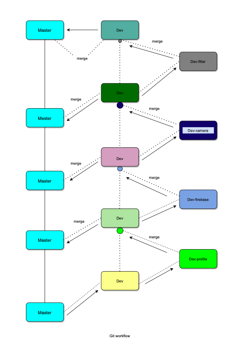
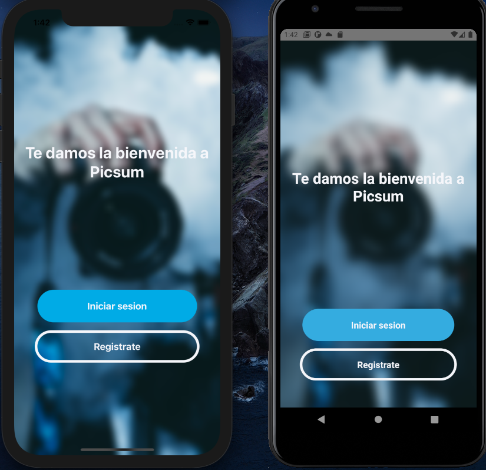
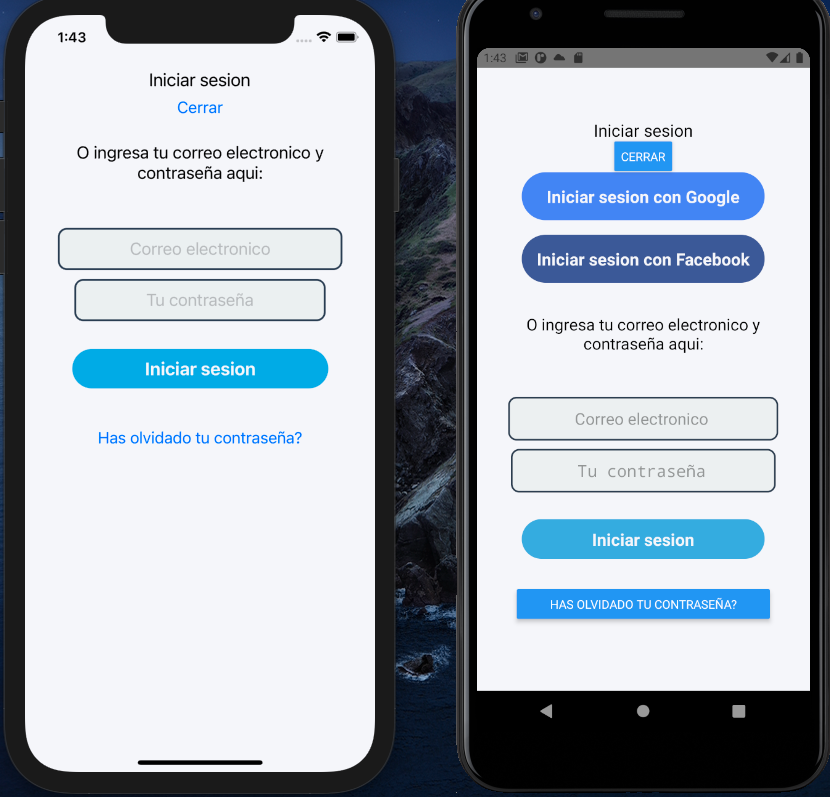
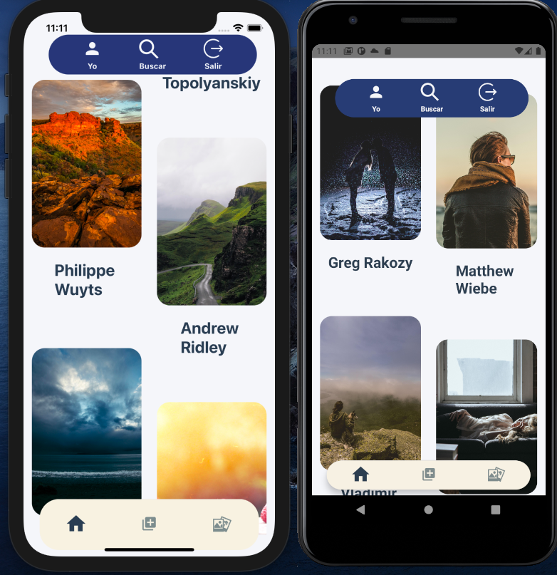
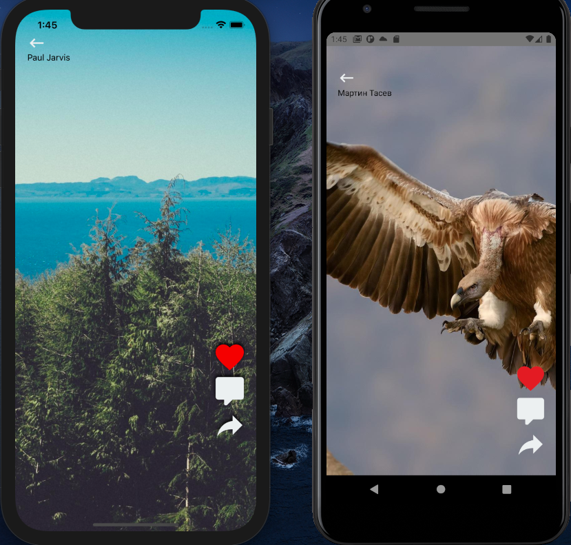
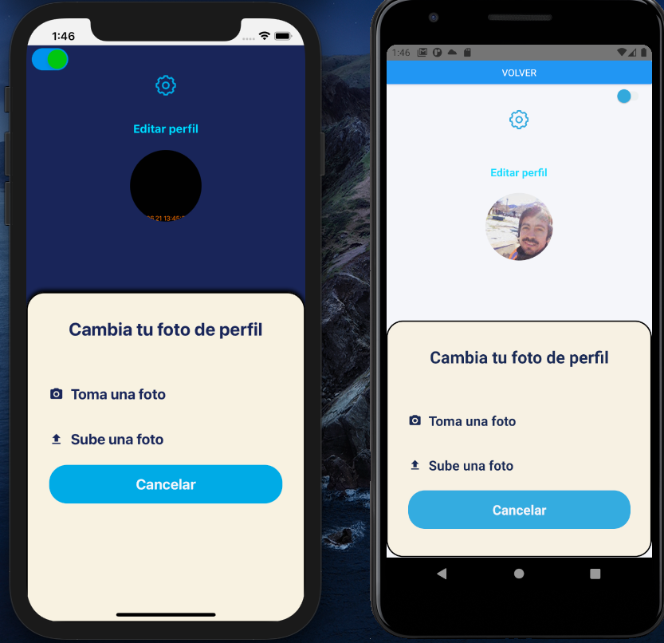

# Picsum 
## Introduction
**Picsum** is a mobile app (IOS and Android) for professional photography where you can check different styles and get some inspiration for your personal work. It was built with React Native.

## Features
**Picsum** has the following features:
- Authentication with google (Android), and also you can create an account for your own with email and password.
- Scroll down to see which photographers are included
- Search by author: Navigate to a specific work once you have the name of a photographer.
- Like: you will be able to like a photo by pressing the classic heart icon.
- Take a picture: you can change your current avatar photo by creating a new one with front camera.
- Upload a picture: Once you navigate to the profile screen, you'll be able to change your avatar photo by uploading a new one from storage.
- Dark Theme: change the theme of Picsum in order to be more comfortable while you navigate. 
- Edit personal information such as biography, username and website.

# For developers
## How **Picsum** was built?  
## Git workflow 

## Architecture:

- Firebase Auth
- React Native Camera
- Redux (thunk) and context

# Instructions for use
## Clone this repository
### 1.- At the terminal: 
git clone [url] + name

cd name

Open the project with your favorite code editor.
### 2.- Back to the terminal:
Enter this command to start Metro:

`yarn start`

### 3.- Still at the terminal:
Open a new window.

Initialize IOS and Android:

command for ios: 

`npx react-native run-ios`

command for android: 

`npx react-native run-android`

### Screeshots (left for IOS and Android at the right side)
Initial screen:

Auth screen:

Main screen:

Photo screen:

Change profile screen:

## Auth view:
### 1.- Sign in with a given email and password:

Email: prueba@prueba.com

Password: pruebaprueba

### 2.- Sign in with a new user:

Press on register button and add a new email and password

### 3.- Sign in with Google (only for Android)

# Personal information: 
## Developer name:
Joaquín Andrés Mellado Quevedo
## Email:
mellado.joaquin@gmail.com

